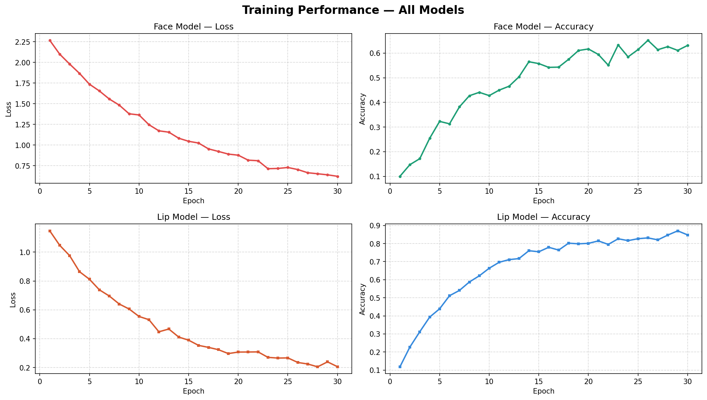

# EDP — Paralysis People Movement Through Lips and Facial Recognition

> Real-time edge-deployed system enabling paralysed individuals to communicate and trigger alerts using only lip movements and facial expressions, running entirely on a Jetson Nano.

---

## Problem Statement

People living with conditions such as ALS, quadriplegia, or severe motor paralysis lose the ability to move their limbs but often retain partial or full control of their facial muscles. Existing assistive technologies are either expensive, cloud-dependent, or too slow for real-time interaction. This project addresses the need for a **low-cost, offline-capable, real-time assistive system** that detects distress and intent purely from facial cues — no touch, no voice, no cloud required.

---

## Role of Edge Computing

| Component | Runs On |
|---|---|
| Lip movement detection | Jetson Nano (GPU) |
| Facial expression classification | Jetson Nano (GPU) |
| Pose / body keypoint estimation | Jetson Nano (GPU) |
| Alert dashboard (Flask) | Jetson Nano (local network) |
| Logging | Jetson Nano (local disk) |

**Why edge instead of cloud?**
- **Latency**: Cloud inference adds 200–800 ms round-trip delay — unacceptable for real-time distress alerting.
- **Privacy**: Patient video never leaves the device.
- **Offline capability**: Works without internet — critical in hospital or home settings.
- **Cost**: No recurring API or cloud compute fees.

---

## Methodology / Approach

```
USB Camera / Video File
        ↓
  preprocessing.py
  (resize, normalise, extract ROI)
        ↓
  inference.py
  ┌─────────────────────────────┐
  │  YOLOv8n-pose               │  → Body keypoints
  │  Lip movement model         │  → Lip state (open/closed/pattern)
  │  Facial expression model    │  → Expression (fear, neutral, distress…)
  └─────────────────────────────┘
        ↓
  behaviour.py (alert logic)
  (track_id + expression + lip_state → alert)
        ↓
  Flask Dashboard + Logger
  (live alerts, FPS, inference time on frame)
```

Each stage:
- **Preprocessing**: Frame is resized, face ROI is cropped, normalised to model input format.
- **Pose model**: YOLOv8n-pose detects body keypoints to confirm subject is in frame.
- **Lip model**: Classifies lip state per frame to detect deliberate movement patterns.
- **Expression model**: Classifies facial expression to detect distress signals (e.g., fear).
- **Alert logic**: Combines lip state + expression + track ID over time to fire alerts.
- **Output**: FPS and inference time overlaid on frame; alerts pushed to Flask dashboard and log file.

---

## Model Details

### 1. YOLOv8n-Pose
| Property | Value |
|---|---|
| Type | YOLO (You Only Look Once) — anchor-free pose model |
| Architecture | CSPDarknet + neck + pose head |
| Input size | 640 × 640 |
| Framework | PyTorch (Ultralytics) |
| Weights file | `yolov8n-pose.pt` |
| Optimization | Optional TensorRT export for Jetson |

### 2. Lip Movement Model
| Property | Value |
|---|---|
| Type | CNN classifier |
| Input | Cropped lip ROI |
| Framework | PyTorch |
| Weights files | `models/lip_model.pt`, `models/lip_model.onnx` |
| Output classes | Open / Closed / Pattern states |

### 3. Facial Expression Model
| Property | Value |
|---|---|
| Type | CNN classifier |
| Input | Cropped face ROI |
| Framework | PyTorch |
| Weights files | `models/face_model.pt`, `models/face_model.onnx` |
| Output classes | Neutral, Fear, Distress, Surprise, etc. |

> Both custom models are exported in **ONNX format** for optimised inference on Jetson Nano.

---

## Training Details

### Datasets
- **YOLOv8n-pose**: Pre-trained on COCO Pose dataset (133 keypoints, 200K+ images).
- **Lip model**: Custom lip state dataset collected and labelled for this project.
- **Face/expression model**: Custom facial expression dataset labelled for distress-relevant expressions.

### Training Procedure
- Framework: PyTorch / Ultralytics
- Optimizer: SGD / Adam
- Loss: Cross-entropy (classification), pose regression loss (keypoints)
- Augmentation: Horizontal flip, brightness/contrast jitter, random crop

### Performance Graphs

Training graphs are saved in the `assets/` folder and generated by `generate_graphs.py` (reads from `logs/pipeline.log`):

| Graph | File |
|---|---|
| All models combined | `assets/all_training_graphs.png` |
| Face model — accuracy | `assets/face_accuracy.png` |
| Face model — loss | `assets/face_loss.png` |
| Lip model — accuracy | `assets/lip_accuracy.png` |
| Lip model — loss | `assets/lip_loss.png` |



To regenerate graphs at any time:
```bash
python generate_graphs.py
```

---

## Results / Output

### System Output
- Live annotated video feed with:
  - Detected face and lip bounding boxes
  - Expression label overlaid on frame
  - Lip state label
  - FPS counter (top-left)
  - Inference time (ms) per frame
- Flask alert dashboard accessible on local network (`http://<jetson-ip>:5000`)
- Structured log file with timestamped alerts

### Sample Alerts
```
2026-04-27 13:08:33  INFO  ALERT distress_expression  track_id=1  expr=fear
2026-04-27 13:08:35  INFO  ALERT lip_movement_detected  track_id=1  pattern=SOS
```

### Performance Metrics

| Metric | Windows PC (dev) | Jetson Nano |
|---|---|---|
| Inference time | ~18 ms | ~45–80 ms |
| FPS | ~35–40 | ~12–20 |
| Power draw | ~65 W | ~5–10 W |
| Internet required | No | No |

---

## Setup Instructions

### Prerequisites
- Jetson Nano with JetPack 4.6+
- Python 3.8+, virtual environment
- USB webcam connected on `/dev/video0`

### 1. Clone the repository
```bash
git clone https://github.com/palveenkaur2312/EDP-Final-Project.git
cd EDP-Final-Project
```

### 2. Create and activate virtual environment
```bash
python3 -m venv .venv
source .venv/bin/activate
```

### 3. Install PyTorch (Jetson-specific wheel)
```bash
# For JetPack 4.6 (check yours with: cat /etc/nv_tegra_release)
pip install https://developer.download.nvidia.com/compute/redist/jp/v461/pytorch/torch-1.11.0a0+17540c5+nv22.01-cp36-cp36m-linux_aarch64.whl
```

### 4. Install remaining dependencies
```bash
pip install -r requirements.txt
```

### 5. Transfer model weights to Jetson
```bash
# Run from your Windows PC (PowerShell) — transfer all model files
scp yolov8n-pose.pt        jetson@<JETSON_IP>:~/EDP-Final-Project/models/
scp face_model.pt          jetson@<JETSON_IP>:~/EDP-Final-Project/models/
scp face_model.onnx        jetson@<JETSON_IP>:~/EDP-Final-Project/models/
scp lip_model.pt           jetson@<JETSON_IP>:~/EDP-Final-Project/models/
scp lip_model.onnx         jetson@<JETSON_IP>:~/EDP-Final-Project/models/
```

### 6. Configure paths
Edit `config.py` and confirm:
```python
MODEL_PATH   = "models/yolov8n-pose.pt"
INPUT_SOURCE = 0          # 0 = USB webcam
LOG_PATH     = "logs/alerts.log"
```

### 7. Run inference only
```bash

cd "C:\Users\msi\OneDrive\THAPAR\EDP Final Project"
.venv\Scripts\activate
python inference.py --source demo.mp4


### 9. Run dashboard only

http://localhost:5000


## Project Structure

```
EDP-Final-Project/
├── main.py                  # Orchestrator + Flask dashboard
├── inference.py             # Inference pipeline
├── preprocessing.py         # Input preparation, feature extraction
├── training.py              # Model training code
├── generate_graphs.py       # Reads pipeline.log → saves training graphs
├── collect_data.py          # Data collection utility
├── demo_seed.py             # Demo seeding script
├── utils.py                 # Helper functions
├── config.py                # Paths, thresholds, parameters
├── logger.py                # Alert logging
├── events.db                # Alert events database
├── requirements.txt         # Dependencies
├── models/
│   ├── face_model.pt        # Face expression model (PyTorch)
│   ├── face_model.onnx      # Face expression model (ONNX)
│   ├── lip_model.pt         # Lip movement model (PyTorch)
│   ├── lip_model.onnx       # Lip movement model (ONNX)
│   └── yolov8n-pose.pt      # YOLOv8 pose model
├── assets/
│   ├── all_training_graphs.png
│   ├── face_accuracy.png
│   ├── face_loss.png
│   ├── lip_accuracy.png
│   └── lip_loss.png
├── data/
│   ├── face_expression/     # Face training data
│   ├── face_processed/
│   ├── lip_movement/        # Lip training data
│   ├── lip_processed/
│   └── pose/
├── logs/
│   └── pipeline.log
└── README.md
```

---

## Authors

**Palveen Kaur** — [@palveenkaur2312](https://github.com/palveenkaur2312)  
Thapar Institute of Engineering & Technology  
Edge & Distributed Processing (EDP) — Final Project, 2026
